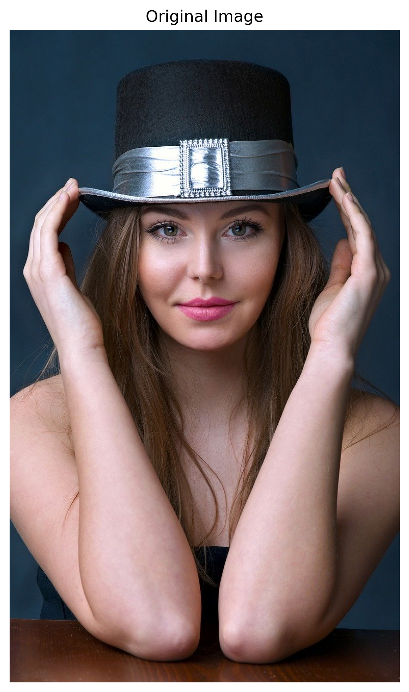
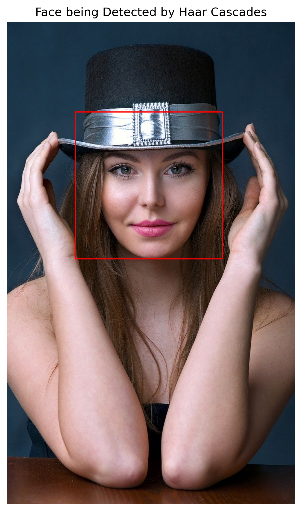
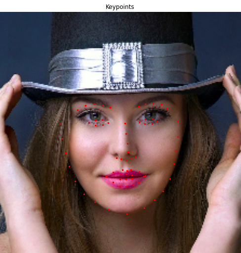
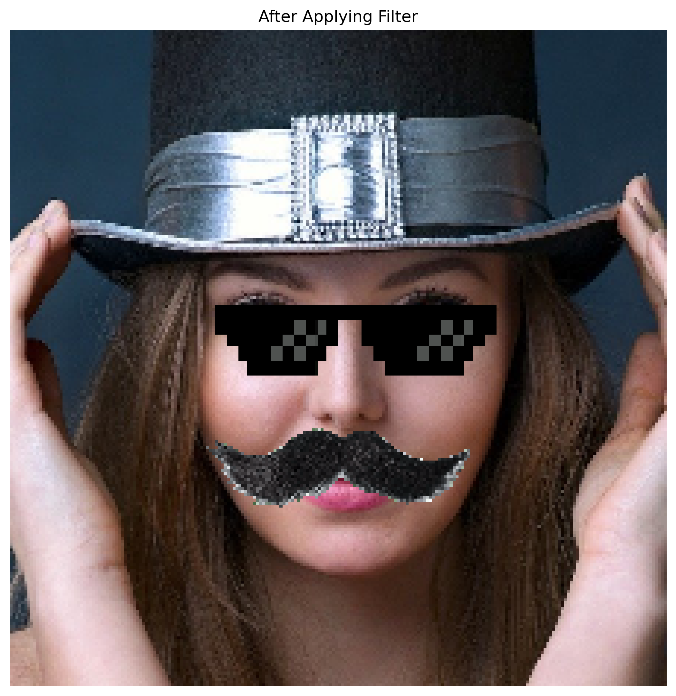

# Facial Keypoint Detection

Facial key-points are relevant for a variety of tasks, such as face filters, emotion recognition, pose recognition, and so on. So if you’re onto these projects, keep reading!

In this project, facial key-points (also called facial landmarks) are the small red dots shown on each of the faces in the image below. In each training and test image, there is a single face and 68 key-points, with coordinates (x, y), for that face. These key-points mark important areas of the face: the eyes, corners of the mouth, the nose, etc.

Apart from just locating the facial key points, I've applied this concept to adding filters to an image in accordance with these generated keypoints.

<p align="center">
  
  
  
  
</p>


The project implementation is done using the Pytorch Framework.

## Installation

Use the package manager [pip](https://pip.pypa.io/en/stable/) to install pip.

```bash
pip install opencv-python
pip install numpy
pip install pandas
pip install matplotlib
```
To install Pytorch follow: [Pytorch](https://pytorch.org/get-started/locally/) 

## Usage

There are three main files each doing different tasks:

1) **1_Facial_Keypoints_Detection.ipynb :** This notebook deals with the preprocessing of the data and training the model.
2) **2_Test FKD.ipynb :** This notebook runs through the entire pipeline of the project, where you give it an image and it outputs the image with the detected Facial Keypoints.
3) **3_Fun with Filters using FKD.ipynb :** This final notebook applies the concept of Facial keypoints detection to a popular know application such as applying filters to an image.

Other files also include the **model.py** that has the model architecture. 

The **data** folder contains the images and keypoints the model was trained on. 

The **cascades** folder has some Haar-cascades that are used to detect faces. You can find out more about it [here](https://docs.opencv.org/3.4/db/d28/tutorial_cascade_classifier.html).

## Contributing
Pull requests are welcome. For major changes, please open an issue first to discuss what you would like to change.

Please make sure to update tests as appropriate.

## Acknowledgments
**Dataset used:**

I've used the [YouTube Faces Dataset](https://www.cs.tau.ac.il/~wolf/ytfaces/), which includes videos of people in YouTube videos.This facial key-points dataset consists of 5770 colour images. All of these images are separated into either a training or a test set of data.

* 3462 of these images are training images, for you to use as you create a model to predict key-points.
* 2308 are test images, which will be used to test the accuracy of your model.
